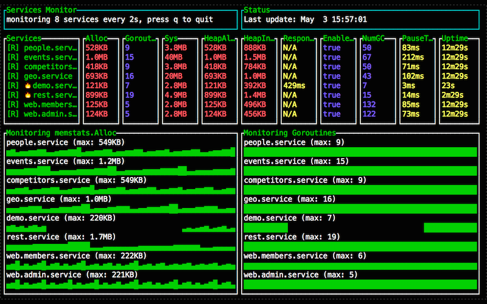
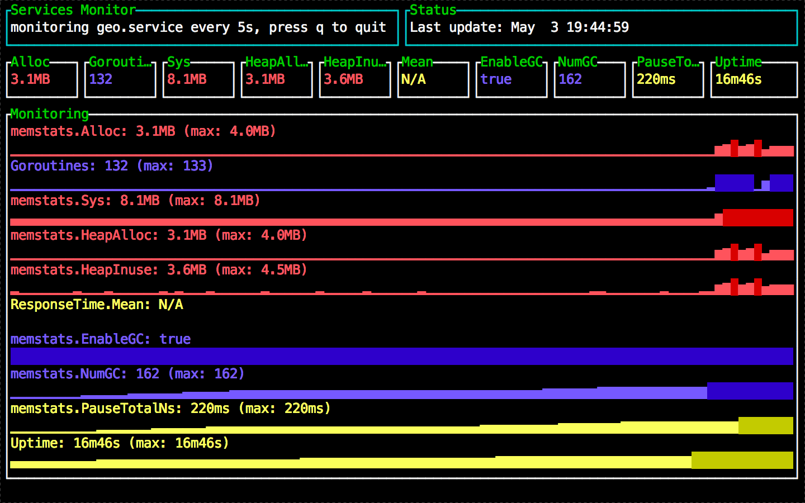
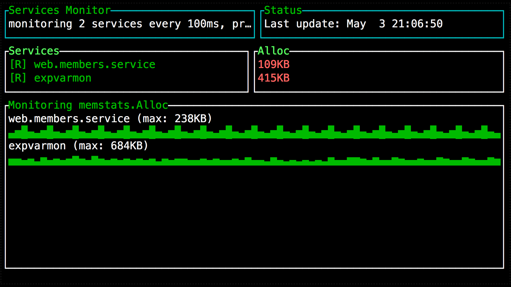
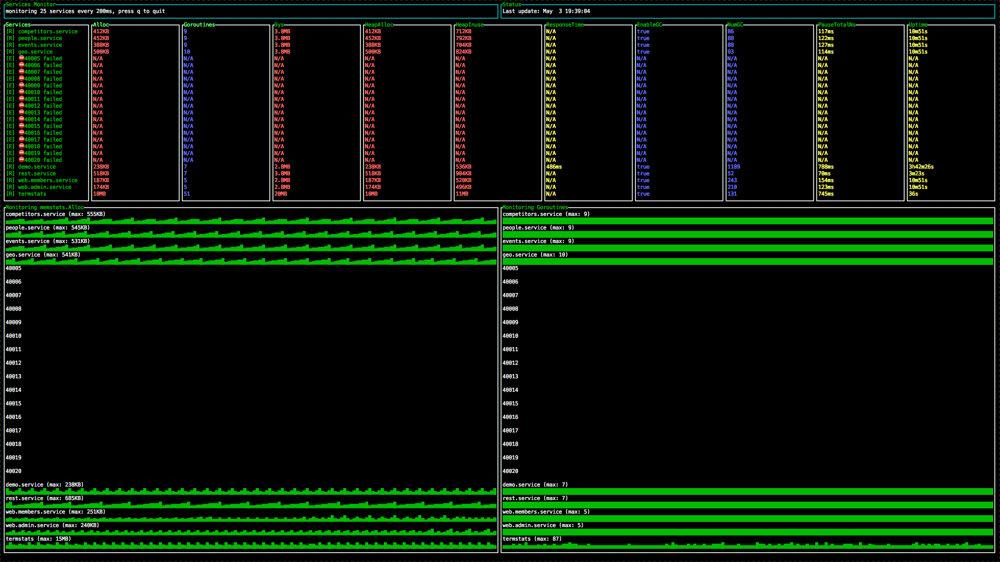

# ExpvarMon

TermUI based Go apps monitor using [expvars](http://golang.org/pkg/expvar/) variables (/debug/vars). Quickest way to monitor your Go app.

## Introduction

Go apps console monitoring tool. Minimal configuration efforts. Quick and fast monitoring solution for one or multiple services.

## Demo

### Multiple apps mode

### Single mode

You can monitor arbitrary number of services and variables:
 
